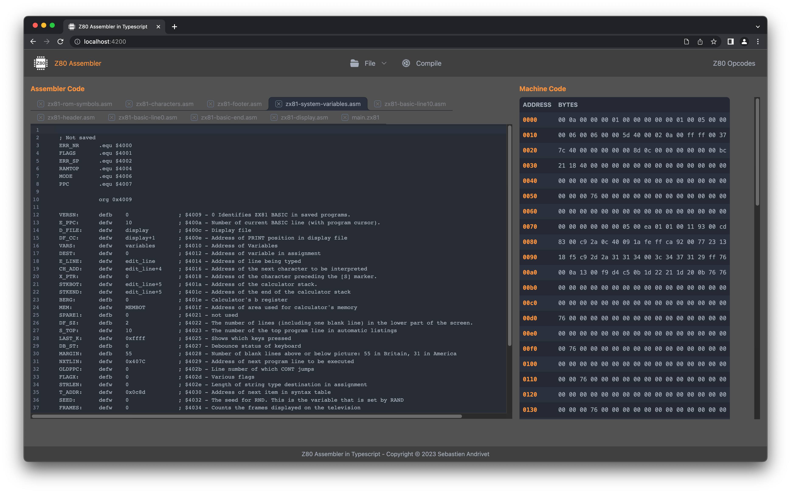
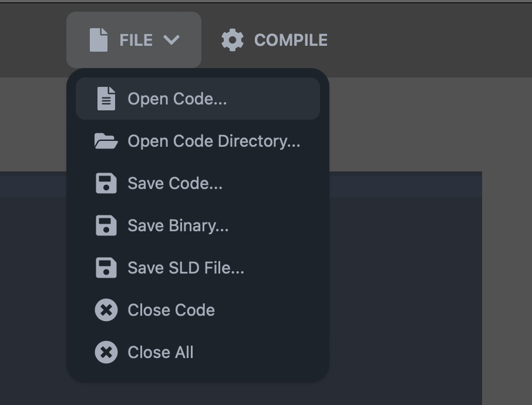
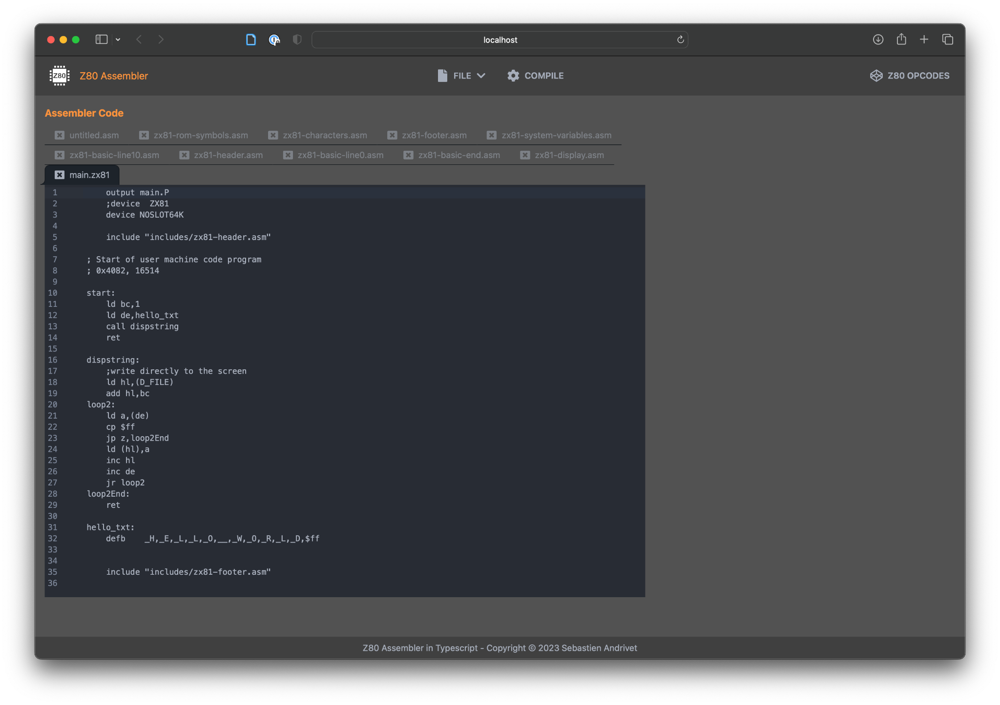
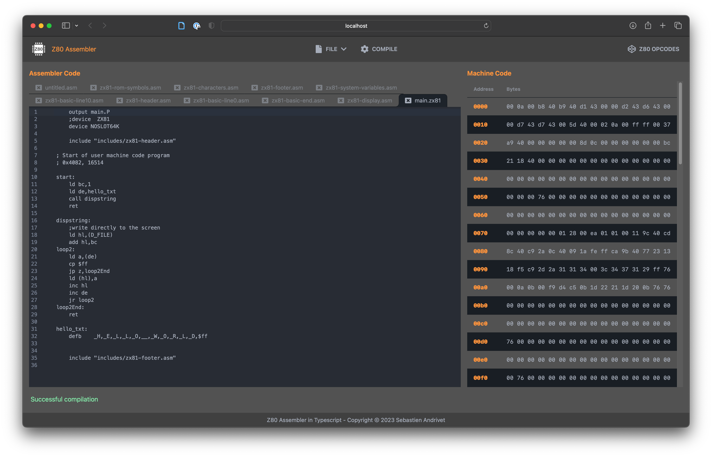
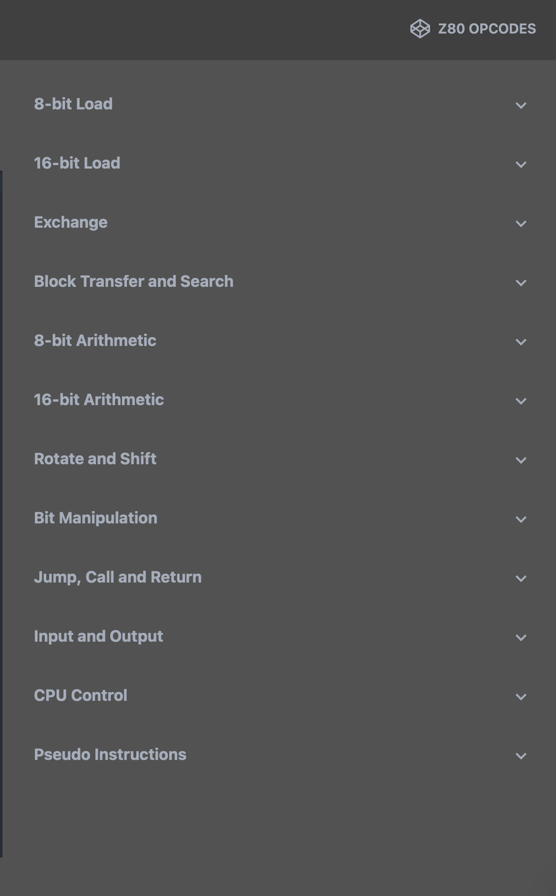
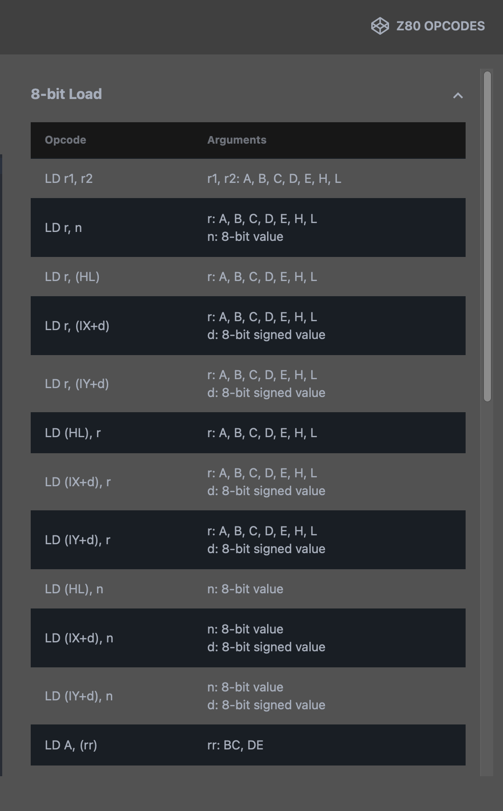

# z80-assembler


A Z80 assembler entirely written in Typescript and derived from a PEG grammar.

## Components

* The first component is the library itself, `z80-assembler` that can be used like any npm library.
* The second component is an application, `z80-assembler-app` that uses this library.
  It can be used by itself or as an example of how to use the library. It is written in Typescript with React.



## How to install

TO WRITE

## How to build from source

```
npm --legacy-peer-deps install
./node_modules/.bin/nx run z80-assembler-app:build:production
```

Notes: 

* For the moment, you have to use `--legacy-peer-deps` because react-daisyui is not yet updated for DaisyUI 3.
Once it is the case, this flag will no more be necessary.

* If you have installed NX globally, you do not need to specify its path.

## How to run the application

```
nx run z80-assembler-app:dev:production
```

Open a navigator at the URL http://localhost:4200/

## Quick guide to use the library

The main function is simply called `compile`. It takes three arguments:

* the name of the source file
* the Z80 source code to compile
* a function used to return the content of included files

It returns an object of type `CompilationInfo` with the following fields:

* `outputName`: The name of the output as set by the `output` directive.
* `bytes`: A array of numbers. Each element represents a byte of the generated machine code.
* `sld`: The Source Level Debugging data as a string. This is used in order to debug the code.
* `errs`: An array of errors

A typical way to use the function is:

```
const info = compile(filepath, code, handleGetFileCode);
if(info.errs.length > 0)
  displayErrors(info.errs);
else
  saveOutput(info.outputName, info.bytes);
```

You can find a complete example in the `z80-assembler-app`, in particular in the `app.tsx` file.

## Quick guide to use the application

Under the **File** menu, you find the following commands:



* **Open Code**: Open a Z80 source file.
* **Open Code Directory**: Open a directory with Z80 source files. This is especially useful if your source files contain includes.
* **Save Code**: Save the current code file.
* **Save Binary**: Save the compiled binary.
* **Save SLD File**: Save the Source Level Debugging data in text format.
* **Close Code**: Close the current code.
* **Close All**: Close all the open codes.



Once one or more files are open, click on Compile to compile the code.
The binary are displayed on the right side:



While writing your Z80 assembly code, you can display the list of Z80 opcodes by clicking on **Z80 Opcodes**:



Click on a category to see the corresponding opcodes:



## Z80 opcodes

This assembler supports all the official Z80 opcodes as defined in Zilog Z80 CPU User Manual.

## Pseudo instructions

This assembler supports the following pseudo-instructions:

* **equ** (or **.equ**): Define a value for a label
* **org** (or **.org**): Set the current address to compile the code.
* **include** (or **.include**): Include another assembly file.
* **device** (or **.device**): Set the current target (device).
* **byte** (or **db**, **dm**, **defb**, **defm**): Define a list of byte values
* **word** (or **dw**, **defw**): Define a list of word values
* **block** (or **defs**, **ds**): Define a block of byte values.


## Limitations

* No support for non-official Z80 opcodes
* No support for fake instructions like `LD BC, DE`. The actual corresponding opcodes are `LD B, D` and  `LD C, E`.
* No support for structures
* No support for conditional assembly and macros

## Licence

This library and application are released under GPLv3.

## Copyrights

Copyright (C) 2023 Sebastien Andrivet
