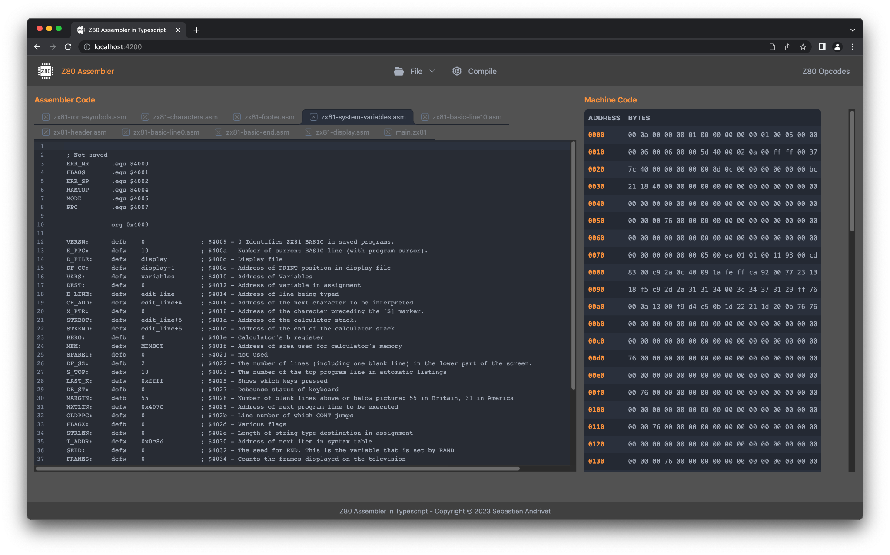
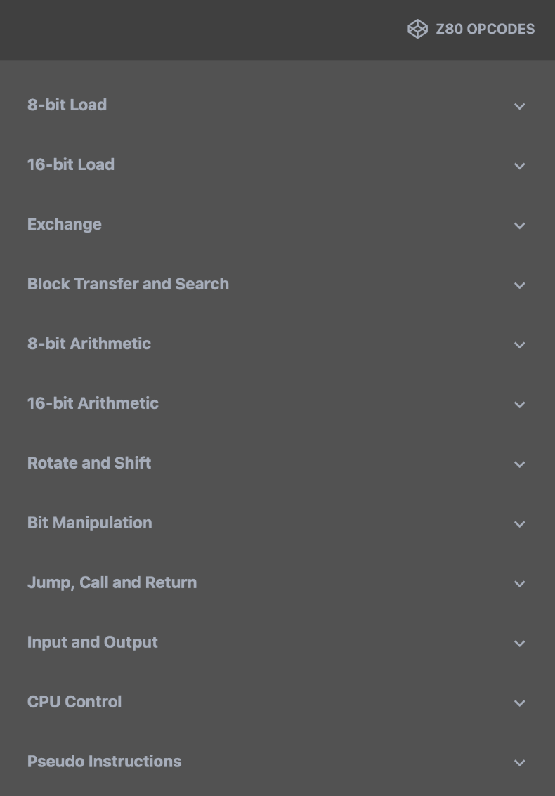
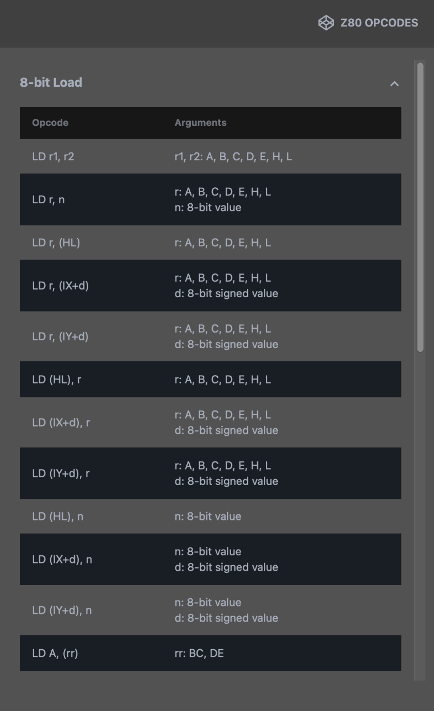

# z80-assembler


A Z80 assembler entirely written in Typescript and derived from a PEG grammar.

## Components

* The first component is the library itself, `z80-assembler` that can be used like any npm library.
* The second component is an application, `z80-assembler-app` that uses this library.
  It can be used by itself or as an example of how to use the library. It is written in Typescript with React.



This assembler is also used in the [ZX81 Debugger](https://github.com/andrivet/ZX81-Debugger).

## How to build from source

```
npm --legacy-peer-deps install
nx run z80-assembler-app:build:production
```

Notes: 

* For the moment, you have to use `--legacy-peer-deps` because react-daisyui is not yet updated for DaisyUI 3.
Once it is the case, this flag will no more be necessary.

* If you have installed NX globally, you do not need to specify its path.

## How to run the application

```
nx run z80-assembler-app:dev:production
```

Open a navigator at the URL http://localhost:4200/


## Quick guide to use the application

Under the **File** menu, you find the following commands:


* **Open Code**: Open a Z80 source file.
* **Open Code Directory**: Open a directory with Z80 source files. This is especially useful if your source files contain includes.
* **Save Code**: Save the current code file.
* **Save Binary**: Save the compiled binary.
* **Save SLD File**: Save the Source Level Debugging data in text format.
* **Close Code**: Close the current code.
* **Close All**: Close all the open codes.


Once one or more files are open, click on Compile to compile the code.
The binary are displayed on the right side:


While writing your Z80 assembly code, you can display the list of Z80 opcodes by clicking on **Z80 Opcodes**:



Click on a category to see the corresponding opcodes:



## Z80 assembly

The format of assembly source file is described in [Z80 Assembly Source Code Format](./docs/assembly.md).


## Licence

This library and application are released under GPLv3.

## Copyrights

Copyright (C) 2023 Sebastien Andrivet
