# Z80 Assembly Source Code Format

## Z80 opcodes

This assembler supports all the official Z80 opcodes as defined in [Zilog Z80 CPU User Manual](https://www.zilog.com/docs/z80/um0080.pdf).
Each z80 opcode has to be on a separate line.

## Z80 non-standard or fake opcodes

Some assemblers (such as [sjasmplus](http://z00m128.github.io/sjasmplus/documentation.html#s_fake_instructions)) support fake opcodes such as `ld bc,de`. This is also the case of this assembler (since version 2.0.0).

* IXh, IXl, IYh, IYl 8 bits registers are supported
* ADC, ADD, AND, CP, DEC, INC, OR, SBC, SUB and XOR with those registers are supported
* LD with those registers are supported
* RL, RLC, RR, RRC, SLA, SRA, SRL with (IX+d) or (IY+d)
* SSL (or SSI) new instruction
* IN F, (C)
* OUT (C), 0

The fake instructions are:

### 16-bit rotate and shift

* rl qq
* rr qq
* sla qq
* sll qq, sli qq
* sra qq
* srl qq

### 16-bit load

* ld qq, qq
* ld qq, ix
* ld qq, iy
* ld qq, (hl)
* ld qq, (ix + nn)
* ld qq, (iy + nn)
* ld ix, qq
* ld iy, qq
* ld iy, ix
* ld ix, iy
* ld (hl), qq
* ld (ix + nn), qq
* ld (iy + nn), qq

### 16-bit load, increment

* ldi qq, (hl)
* ldi qq, (ix + nn)
* ldi qq, (iy + nn)
* ldi (hl), qq
* ldi (ix + nn), qq
* ldi (iy + nn), qq

### 8-bit load, increment

* ldi a, (bc)
* ldi a, (de)
* ldi r, (hl)
* ldi r, (ix + nn)
* ldi r, (iy + nn)
* ldi (bc), a
* ldi (de), a
* ldi (hl), r
* ldi (ix + nn), r
* ldi (iy + nn), r
* ldi (hl), n
* ldi (ix + nn), n
* ldi (iy + nn), n

### 8-bit load, decrement

* ldd a, (bc)
* ldd a, (de)
* ldd r, (hl)
* ldd r, (ix + nn)
* ldd r, (iy + nn)
* ldd (bc), a
* ldd (de), a
* ldd (hl), r
* ldd (ix + nn), r
* ldd (iy + nn), r
* ldd (hl), n
* ldd (ix + nn), n
* ldd (iy + nn), n

### 16-bit arithmetic

* adc de, ss
* add de, ss
* sbc de, ss
* sub de, ss
* sub hl, ss

## Labels

Labels are sequence of characters representing a numerical value. It is often an address but can be something else.
The name of a label has to start with a letter, an underscore or a period and continues with a letter, a digit or one of those characters: `_!?#@.$`.
Case is ignored. Labels have to be unique. There is (currently) no notion of global or local labels.

When they are declared, label have to be at the beginning of a line. They can be optionally followed by a column (`:`). This is not part of the name.
If the label is followed by `equ` (or `.equ`), it takes the value of the expression after this keyword. Otherwise, the value of the label is the address of the next instruction.

```
label1:
  ld a,1
```

```
label2 equ 1234h
```

Labels can be used in expressions by using their name (without the column). This label is replaced by its value when evaluated.
It is possible to use labels before their declaration. This is typically the case in code such as:

```
  jr z,label1
  ...
label1:
  ...
```

The value of a label can't be ambiguous. For example, the following code results in a compilation error because the two labels are dependent of each other (cycle) :

```
label1 equ label2
label2 equ label1
```

Likewise, the following code is ambiguous in a more subtle way (the size of the block depends on label1 and label1 depends on the size of the block):

```
  block label1
  ...
label1:
...
```

## Numeric Constants

Numeric constants can be declared in decimal, hexadecimal, octal or binary using a prefix

| Prefix | Base        | Example   |
|--------|-------------|-----------|
| none   | Decimal     | 123       |
| $      | Hexadecimal | $ab12     |
| #      | Hexadecimal | #ab12     |
| @      | Octal       | @123      |
| &      | Binary      | &00001000 |

It is also possible to use prefixes starting with `0`, similar to the syntax of the C language:

| Prefix | Base        | Example    |
|--------|-------------|------------|
| 0x     | Hexadecimal | 0xab12     |
| 0o     | Octal       | 0o123      |
| 0q     | Octal       | 0q123      |
| 0b     | Binary      | 0b00001000 |

Another possibility is to use a suffix:

| Suffix | Base        | Example     |
|--------|-------------|-------------|
| d      | Decimal     | 123d        |
| h      | Hexadecimal | ab12h       |
| q      | Octal       | 123q        |
| o      | Octal       | 123o        |
| b      | Binary      | 0b00001000b |

Hexadecimal digits, prefixes and suffixes are not case-sensitive. The following constants are all equivalent:

```
AB12H
ab12h
Ab12H
0xAB12
0Xab12
```

> Note: `abh` is ambiguous. It could be the hexadecimal value `ab` or the label `abh`.
> Some assemblers require to start such hexadecimal value with `0`. This is not the case here.
> The sequence of characters is interpreted as an hexadecimal value.

## Character and String Constants

Character and string constants are enclosed in single or double quotes. 
The ASCII (more precisely Latin-1) characters and translated into their ZX81 counterparts if it is possible:

| Latin-1 | Code | ZX81                        | Code | | Latin-1 | Code | ZX81                        | Code |
|---------|------|-----------------------------|------|-|---------|------|-----------------------------|------|
|         | 20h  |  | 00h  | | _       |      |  | 80h  |
| "       | 22h  |  | 0Bh  | |         |      |                             |      |
| £       | A3h  | 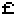 | 0Ch  | |         |      |                             |      |
| $       | 24h  | 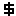 | 0Dh  | |         |      |                             |      |
| :       | 3Ah  | 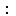 | 0Eh  | |         |      |                             |      |
| ?       | 3Fh  |  | 0Fh  | |         |      |                             |      |
| (       | 28h  | 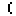 | 10h  | |         |      |                             |      |
| )       | 29h  | 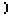 | 11h  | |         |      |                             |      |
| >       | 3Ch  |  | 12h  | |         |      |                             |      |
| <       | 3Eh  |  | 13h  | |         |      |                             |      |
| =       | 3Dh  | 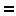 | 14h  | |         |      |                             |      |
| +       | 2Bh  | 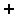 | 15h  | |         |      |                             |      |
| -       | 2Dh  | 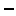 | 16h  | |         |      |                             |      |
| *       | 2Ah  | 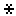 | 17h  | |         |      |                             |      |
| /       | 2Fh  |  | 18h  | |         |      |                             |      |
| ;       | 3Bh  | 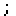 | 19h  | |         |      |                             |      |
| ,       | 2Ch  | 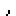 | 1Ah  | |         |      |                             |      |
| .       | 2Eh  |  | 1Bh  | |         |      |                             |      |
| 0       | 30h  |  | 1Ch  | |         |      |                             |      |
| 1       | 31h  | 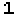 | 1Dh  | |         |      |                             |      |
| 2       | 32h  |  | 1Eh  | |         |      |                             |      |
| 3       | 33h  |  | 1Fh  | |         |      |                             |      |
| 4       | 34h  | 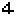 | 20h  | |         |      |                             |      |
| 5       | 35h  |  | 21h  | |         |      |                             |      |
| 6       | 36h  | 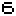 | 22h  | |         |      |                             |      |
| 7       | 37h  | 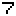 | 23h  | |         |      |                             |      |
| 8       | 38h  |  | 24h  | |         |      |                             |      |
| 9       | 39h  |  | 25h  | |         |      |                             |      |
| A       | 31h  | 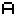 | 26h  | | a       | 61h  |  | A6h  |
| B       | 32h  |  | 27h  | | b       | 62h  |  | A7h  |
| C       | 33h  |  | 28h  | | c       | 63h  |  | A8h  |
| D       | 34h  |  | 29h  | | d       | 64h  |  | A9h  |
| E       | 35h  |  | 2Ah  | | e       | 65h  |  | AAh  |
| F       | 36h  |  | 2Bh  | | f       | 66h  |  | ABh  |
| G       | 37h  |  | 2Ch  | | g       | 67h  |  | ACh  |
| H       | 38h  |  | 2Dh  | | h       | 68h  |  | ADh  |
| I       | 39h  | 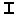 | 2Eh  | | i       | 69h  |  | AEh  |
| J       | 3Ah  |  | 2Fh  | | j       | 6Ah  |  | AFh  |
| K       | 3Bh  |  | 30h  | | k       | 6Bh  |  | B0h  |
| L       | 3Ch  |  | 31h  | | l       | 6Ch  |  | B1h  |
| M       | 3Dh  | 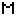 | 32h  | | m       | 6Dh  |  | B2h  |
| N       | 3Eh  | 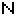 | 33h  | | n       | 6Eh  |  | B3h  |
| O       | 3Fh  |  | 34h  | | o       | 6Fh  |  | B4h  |
| P       | 50h  | 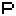 | 35h  | | p       | 70h  |  | B5h  |
| Q       | 51h  |  | 36h  | | q       | 71h  |  | B6h  |
| R       | 52h  | 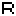 | 37h  | | r       | 72h  |  | B7h  |
| S       | 53h  |  | 38h  | | s       | 73h  |  | B8h  |
| T       | 54h  |  | 39h  | | t       | 74h  |  | B9h  |
| U       | 55h  |  | 3Ah  | | u       | 75h  |  | BAh  |
| V       | 56h  |  | 3Bh  | | v       | 76h  |  | BBh  |
| W       | 57h  |  | 3Ch  | | w       | 77h  |  | BCh  |
| X       | 58h  |  | 3Dh  | | x       | 78h  |  | BDh  |
| Y       | 59h  | 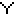 | 3Eh  | | y       | 79h  |  | BEh  |
| Z       | 5Ah  | 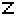 | 3Fh  | | z       | 7Ah  |  | BFh  |

Upper case letters are translated into their black on white counterparts, lower case letters into white on black capital counterparts.

To avoid these translations, use the directive `device` with the value `z80`.

Strings and characters can contain escape sequences:

| Escape | Description      | Code  |
|--------|------------------|-------|
| \n     | New Line         | 76h   |
| \"     | Double quote     | 0Bh   |
| \123   | Octal value      | 53h   |
| \x60   | Hexdecimal value | 60h   |

## Location Counter Symbol

The current value of the location counter (PC) can be used in expressions by using `$`. 
The location counter is the address of the instruction or directive (its first byte) on the line.

## Expressions

Expressions can be used when a numerical value is expected. They are comprised of:

* Labels
* Numerical constants
* Location Counter Symbol
* Operators
* Parenthesis

The available operators are the following, in order of precedence:

| Operator | Type           | Description    |
|----------|----------------|----------------|
| -        | Unary          | Negation       |
| +        | Unary          | No effect      |
| ~        | Unary          | Bits inversion |
| *        | Multiplicative | Multiplication |
| %        | Multiplicative | Modulo         |
| /        | Multiplicative | Division       |
| +        | Additive       | Addition       |
| -        | Additive       | Substraction   |
| <<       | Shift          | Left Shift     |
| \>>      | Shift          | Right Sift     |
| &        | And            | Bitwise And    |
| ^        | Xor            | Bitwise Xor    |
| \|       | Or             | Bitwise Or     |

## Directives

This assembler supports the following directives:

* `equ` (or `.equ`): Define a value for a label
* `org` (or `.org`): Set the current address to compile the code.
* `include` (or `.include`): Include another assembly file.
* `device` (or `.device`): Set the current target (device).
* `byte` (or `db`, `dm`, `defb`, `defm`): Define a list of byte values
* `word` (or `dw`, `defw`): Define a list of word values
* `block` (or `defs`, `ds`): Define a block of byte values.
* `end` (or `.end`): This directive is optional and will stop the generation of binary.

### equ Directive

This directive defines explicitly the value of a label. The formats are the following:

```
label   equ expression
label  .equ expression
label:  equ expression
label: .equ expression
label:    = expression
label:    = expression
```

### org Directive

Set explicitly the value of the program counter (PC). The formats are the following:

```
[label]  org expression
[label] .org expression
```

The label is optional. The program counter is assigned the value of the expression.
For example, to generate code starting at address `4009h`, the following could be done:

```
  org 4009h
```

### include Directive

The include directive reads in and assembles another source file. The formats are the following:

```
   include "filename.zx81"
  .include filename.zx81
```

The double quotes are optional unless there is a space in the filename.

### device Directive

The device directive modifies the binary generated for the given computer. The formats are the following:

```
   device name
  .device name
```

The following values are allowed:

* `zx81`
* `zx81raw`
* `z80`

#### ZX81 device

When `device zx81` is specified in the source code, the assembler performs the following:

* It defines labels for all system variables and it defines appropriate values for those system variables.
* It defines labels for all ZX81 characters.
* It generates bytes for a first BASIC line containing the compiled program (in a `REM` statement).
* It generates bytes for a second BASIC line calling the compiled program.
* It generates bytes for the display file (D_FILE).
* It assigns implicitly 4082h (16514) to the Program Counter.

To summarize, you only have to write the code of your assembly program and the assembler will take care of the rest.

The following labels are created for system variables at the start of the RAM:

| Label  | Value | Size |
|--------|-------|------|
| ERR_NR | 4000h | 1    |
| FLAGS  | 4001h | 1    |
| ERR_SP | 4002h | 2    |
| RAMTOP | 4004h | 2    |
| MODE   | 4006h | 1    |
| PPC    | 4007h | 2    |
| VERSN  | 4009H | 1    |
| E_PPC  | 400AH | 2    |
| D_FILE | 400CH | 2    |
| DF_CC  | 400EH | 2    |
| VARS   | 4010H | 2    |
| DEST   | 4012H | 2    |
| E_LINE | 4014H | 2    |
| CH_ADD | 4016H | 2    |
| X_PTR  | 4018H | 2    |
| STKBOT | 401AH | 2    |
| STKEND | 401CH | 2    |
| BERG   | 401EH | 1    |
| MEM    | 401FH | 2    |
| SPARE1 | 4021H | 1    |
| DF_SZ  | 4022H | 1    |
| S_TOP  | 4023H | 2    |
| LAST_K | 4025H | 2    |
| DB_ST  | 4027H | 1    |
| MARGIN | 4028H | 1    |
| NXTLIN | 4029H | 2    |
| OLDPPC | 402BH | 2    |
| FLAGX  | 402DH | 1    |
| STRLEN | 402EH | 2    |
| T_ADDR | 4030H | 2    |
| SEED   | 4032H | 2    |
| FRAMES | 4034H | 2    |
| COORDS | 4036H | 2    |
| PR_CC  | 4038H | 1    |
| S_POSN | 4039H | 2    |
| CDFLAG | 403BH | 1    |
| PRBUF  | 403CH | 33   |
| MEMBOT | 404DH | 30   |
| SPARE2 | 407DH | 2    |

The following labels are defined for ZX81 printable characters:

| Label | Value | Character                   | | Label | Value | Character                   |
|-------|-------|-----------------------------|-|-------|-------|-----------------------------|
| __    | 00h   |  | |       |       |                             |
| _SPC  | 00h   |  | | _SPCV | 80h   |  |
| _DQT  | 0bh   |  | | _DQTV | 8bh   | 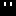 |
| _PND  | 0ch   |  | | _PNDV | 8ch   |  |
| _DLR  | 0dh   |  | | _DLRV | 8dh   |  |
| _CLN  | 0eh   |  | | _CLNV | 8eh   |  |
| _QMK  | 0fh   |  | | _QMKV | 8fh   |  |
| _OBR  | 10h   |  | | _OBRV | 90h   | 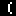 |
| _CBR  | 11h   |  | | _CBRV | 91h   | 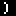 |
| _GTH  | 12h   |  | | _GTHV | 92h   |  |
| _LTH  | 13h   |  | | _LTHV | 93h   |  |
| _EQU  | 14h   |  | | _EQUV | 94h   | 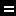 |
| _PLS  | 15h   |  | | _PLSV | 95h   |  |
| _MNS  | 16h   |  | | _MNSV | 96h   | 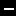 |
| _ASK  | 17h   |  | | _ASKV | 97h   |  |
| _SLS  | 18h   |  | | _SLSV | 98h   |  |
| _SMC  | 19h   |  | | _SMCV | 99h   | 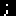 |
| _CMA  | 1ah   |  | | _CMAV | 9ah   | 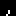 |
| _FST  | 1bh   |  | | _FSTV | 9bh   | 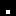 |
| _0    | 1ch   |  | | _0V   | 9ch   |  |
| _1    | 1dh   |  | | _1V   | 9dh   |  |
| _2    | 1eh   |  | | _2V   | 9eh   |  |
| _3    | 1fh   |  | | _3V   | 9fh   |  |
| _4    | 20h   |  | | _4V   | a0h   |  |
| _5    | 21h   |  | | _5V   | a1h   |  |
| _6    | 22h   |  | | _6V   | a2h   |  |
| _7    | 23h   |  | | _7V   | a3h   |  |
| _8    | 24h   |  | | _8V   | a4h   |  |
| _9    | 25h   |  | | _9V   | a5h   |  |
| _A    | 26h   |  | | _AV   | a6h   |  |
| _B    | 27h   |  | | _BV   | a7h   |  |
| _C    | 28h   |  | | _CV   | a8h   |  |
| _D    | 29h   |  | | _DV   | a9h   |  |
| _E    | 2ah   |  | | _EV   | aah   |  |
| _F    | 2bh   |  | | _FV   | abh   |  |
| _G    | 2ch   |  | | _GV   | ach   |  |
| _H    | 2dh   |  | | _HV   | adh   |  |
| _I    | 2eh   |  | | _IV   | aeh   |  |
| _J    | 2fh   |  | | _JV   | afh   |  |
| _K    | 30h   |  | | _KV   | b0h   |  |
| _L    | 31h   |  | | _LV   | b1h   |  |
| _M    | 32h   |  | | _MV   | b2h   |  |
| _N    | 33h   |  | | _NV   | b3h   |  |
| _O    | 34h   |  | | _OV   | b4h   |  |
| _P    | 35h   |  | | _PV   | b5h   |  |
| _Q    | 36h   |  | | _QV   | b6h   |  |
| _R    | 37h   |  | | _RV   | b7h   |  |
| _S    | 38h   |  | | _SV   | b8h   |  |
| _T    | 39h   |  | | _TV   | b9h   |  |
| _U    | 3ah   |  | | _UV   | bah   |  |
| _V    | 3bh   |  | | _VV   | bbh   |  |
| _W    | 3ch   |  | | _WV   | bch   |  |
| _X    | 3dh   |  | | _XV   | bdh   |  |
| _Y    | 3eh   |  | | _YV   | beh   |  |
| _Z    | 3fh   |  | | _ZV   | bfh   |  |


The following labels are defined for ZX81 non-printable characters and keywords:

| Label      | Value |
|------------|-------|
| _RND       | 40h   |
| _INKEY$    | 41h   |
| _PI        | 42h   |
| _UP        | 70h   |
| _DOWN      | 71h   |
| _LEFT      | 72h   |
| _RIGHT     | 73h   |
| _GRAPHICS  | 74h   |
| _EDIT      | 75h   |
| _NEWLINE   | 76h   |
| _NL        | 76h   |
| _RUBOUT    | 77h   |
| _KL_MODE   | 78h   |
| _FUNCTION  | 79h   |
| _NUMBER    | 7Eh   |
| _CURSOR    | 7Fh   |
| _DQUOTES   | C0h   |
| _AT        | C1h   |
| _TAB       | C2h   |
| _CODE      | C4h   |
| _VAL       | C5h   |
| _LEN       | C6h   |
| _SIN       | C7h   |
| _COS       | C8h   |
| _TAN       | C9h   |
| _ASN       | CAh   |
| _ACS       | CBh   |
| _ATN       | CCh   |
| _LN        | CDh   |
| _EXP       | CEh   |
| _INT       | CFh   |
| _SQR       | D0h   |
| _SGN       | D1h   |
| _ABS       | D2h   |
| _PEEK      | D3h   |
| _USR       | D4h   |
| _STR$      | D5h   |
| _CHR$      | D6h   |
| _NOT       | D7h   |
| _PWR       | D8h   |
| _OR        | D9h   |
| _AND       | DAh   |
| _LESS      | DBh   |
| _GREATER   | DCh   |
| _NOT_EQUAL | DDh   |
| _THEN      | DEh   |
| _TO        | DFh   |
| _STEP      | E0h   |
| _LPRINT    | E1h   |
| _LLIST     | E2h   |
| _STOP      | E3h   |
| _SLOW      | E4h   |
| _FAST      | E5h   |
| _NEW       | E6h   |
| _SCROLL    | E7h   |
| _CONT      | E8h   |
| _DIM       | E9h   |
| _REM       | EAh   |
| _FOR       | EBh   |
| _GOTO      | ECh   |
| _GOSUB     | EDh   |
| _INPUT     | EEh   |
| _LOAD      | EFh   |
| _LIST      | F0h   |
| _LET       | F1h   |
| _PAUSE     | F2h   |
| _NEXT      | F3h   |
| _POKE      | F4h   |
| _PRINT     | F5h   |
| _PLOT      | F6h   |
| _RUN       | F7h   |
| _SAVE      | F8h   |
| _RAND      | F9h   |
| _IF        | FAh   |
| _CLS       | FBh   |
| _UNPLOT    | FCh   |
| _CLEAR     | FDh   |
| _RETURN    | FEh   |
| _COPY      | FFh   |

#### ZX81raw device

When `device zx81raw` is specified in the source code, the assembler does not define labels or emit any code.
It is up to you to define labels and to generate the prefix and postfix bytes.
This device is especially useful when taking an existing ZX81 program that already define labels.
In this mode, strings are still translated, as described previously, between ASCII and the ZX81 characters set.

#### Z80 device

This is similar to `ZX81raw` device, but in this mode, strings are not translated.

### byte Directive

The `byte` directive defines a sequence of bytes and their values. The values are separated by commas and can be expressions, characters or strings.
The formats are the following:

```
[label]  byte expression [, expression ...]
[label] .byte expression [, expression ...]
[label]  db   expression [, expression ...]
[label]  dm   expression [, expression ...]
[label]  defb expression [, expression ...]
[label]  defm expression [, expression ...]
```

Examples:

```
label1:
  byte 'a', $76, "TEST", _NL
```

### word Directive

The `word` directive defines a sequence of 16-bit words and their values. 
The values are separated by commas and can be expressions. 
They are stored in little-endian format with the least significant byte first, followed by the most significant byte.
The formats are the following:

```
[label]  word expression [, expression ...]
[label] .word expression [, expression ...]
[label]  dw   expression [, expression ...]
[label]  defw expression [, expression ...]
```

Examples:

```
label1:
  word 0xABCD, %0100002000000000
```

### block Directive

The `block` directive defines a sequence of bytes that are filled with the same value. The formats are the following:

```
[label]  block expression [, expression]
[label] .block expression [, expression]
[label]  ds    expression [, expression]
[label]  defs  expression [, expression]
```

The first expression gives the number of bytes, the second and optional expression gives the value to used to fill the bytes.
If this value is omitted, the block is filled with zeros.

### end Directive

The `end` directive stopped the generation of the binary. It is optional. If it is omitted, the generation stops at the end of the file.

## Comments

Comments begin with a semicolon (`;`) or two slashes (`//`). The rest of the line from the semicolon to the end of the line is ignored.


## Limitations

* No support for non-official Z80 opcodes.
* No support for fake instructions like `LD BC, DE`. The actual corresponding opcodes are `LD B, D` and  `LD C, E`.
* No support for structures.
* No support for conditional assembly and macros.
* Each instruction has to be on a separate line.
* It is not allowed to declare labels with the same name as an instruction. So, for example, `ld` is not an allowed name for a label.
